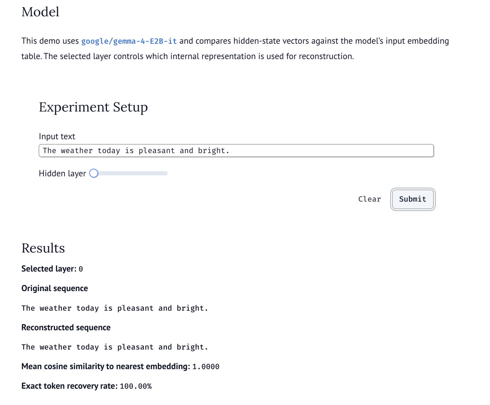
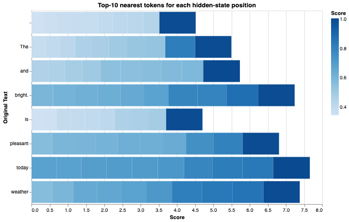

# Language Models Are Injective - Interactive Demonstration

[](https://molab.marimo.io/github/c2p-cmd/research_to_life/blob/master/language_models_are_injective_demo.py)

This repository contains interactive marimo notebooks demonstrating the paper:

**"LANGUAGE MODELS ARE INJECTIVE AND HENCE INVERTIBLE"** (ICLR 2026)
[Paper Link](https://alphaxiv.org/abs/2510.15511)

## Key Findings

### The Core Discovery

- **Injectivity**: Decoder-only Transformers are almost-surely injective
- Different inputs → Different hidden representations (almost always)
- Hidden states preserve input information

## Files

### Core Implementation

- **`language_models_are_injective_demo.py`**: Main interactive demo notebook

### How to Run

```bash
# Install dependencies
uv sync

# Run the demo
uv run marimo edit language_models_are_injective_demo.py
```

### Privacy & Ethics

> "Any system storing, caching, or transmitting hidden states is effectively handling verbatim user text."

- **Storing hidden states = Storing user prompts!**
- **GDPR compliance** requires treating internal representations as personal data
- **Privacy policies** need updates to reflect this reality

### Key Takeaways

- LLMs are not "lossy" as previously assumed
- Hidden states are lossless encodings of inputs
- Foundation for provable interpretability



